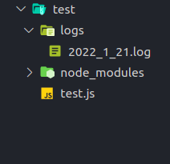

# logger4javascript
## How to use this package
 ✅ First of all create a new /logs  📂 folder where you main (server.js or index.js) files belongs.
  ##
 

 * Example:

   * const logger4javascript = require('logger4javascript');
   * logger4javascript.info('[info] You are testing logger4javascript package for SUCCESS RESPONSE');
   * logger4javascript.info('[error] You are testing logger4javascript package for ERROR RESPONSE');

#

 * Why Should I Use logger4javascript?🤔
    - Simple answer 😀 it is very easy to use logger4javascript, you just need to write 1 line.